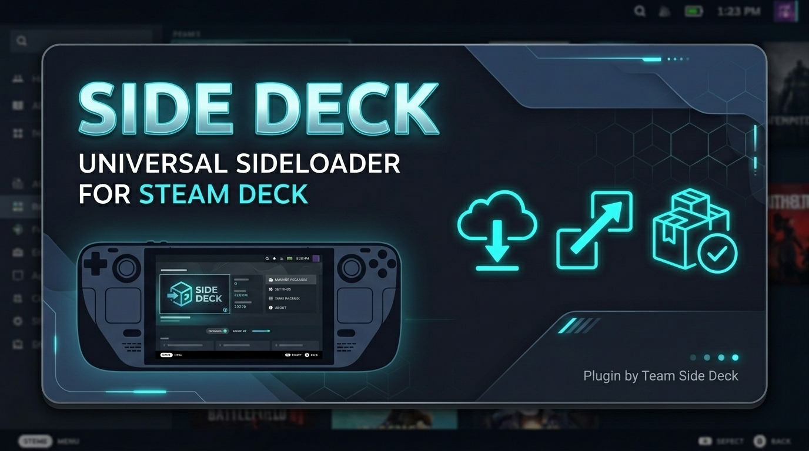

# Release Deck

<div align="center">
  <p><strong>Universal Git Release Downloader & Game Package Manager for Steam Deck (SteamOS Gaming Mode)</strong></p>
  <p>
    <a href="https://github.com/RhanCandia/ReleaseDeck/releases"></a>
    <a href="LICENSE"></a>
    <a href="https://deckbrew.xyz"></a>
    <a href="https://ko-fi.com/rhncnd"></a>
  </p>
  <br />
  
</div>

---

## Overview

**Release Deck** is a Decky Loader plugin for SteamOS that lets you install, update, and manage open-source games, standalone emulators, source ports, PC decompilations, and free indie games directly from the **Quick Access Menu (`...` button)** in **Gaming Mode**.

Instead of switching to Desktop Mode, downloading archives through a web browser, manually extracting folders, and configuring Non-Steam shortcuts in Steam, Release Deck automates the entire process in Gaming Mode with complete controller support.

### Supported Sources
- **GitHub (Default)**: Enter `owner/repo` shorthand (e.g. [`shadps4-emu/shadPS4`](https://github.com/shadps4-emu/shadPS4)).
- **itch.io**: Paste free game URLs (e.g. [`https://undreamedpanic.itch.io/gamma-emerald-ea`](https://undreamedpanic.itch.io/gamma-emerald-ea)).
- **Custom Git Forges & Self-Hosted Instances**: Paste full URLs or domain paths for Forgejo, Gitea, Codeberg, and GitLab (e.g. [`https://git.eden-emu.dev/eden-emu/eden`](https://git.eden-emu.dev/eden-emu/eden) or [`https://codeberg.org/forgejo/forgejo`](https://codeberg.org/forgejo/forgejo)).

---

## What Release Deck Automates

| Task | Without Release Deck (Manual) | With Release Deck |
| :--- | :--- | :--- |
| **Download Releases** | Switch to Desktop Mode, open browser, navigate to releases page, download archive file. | Browse versions, changelogs, and assets directly from the Quick Access Menu in Gaming Mode. |
| **Archive Extraction** | Open Ark/terminal, extract `.tar.gz`, `.zip`, or `.tar.xz`, handle nested folders. | Automatically streams, extracts, and organizes files into `~/Applications/<AppName>/`. |
| **Binary Permissions** | Open terminal to run `chmod +x` on executables and AppImages. | Automatically scans and grants executable permissions to all runnable binaries and scripts. |
| **Steam Shortcut Setup** | Open Steam Desktop client, click "Add a Non-Steam Game", browse filesystem to locate binary, configure working directory. | 1-Click "Add to Steam" discovers executables and registers the Non-Steam shortcut via Steam IPC. |
| **Updates & Upgrades** | Manually check for new releases periodically, re-download, re-extract, and re-configure. | Automatic version comparison with "Update Available" indicators and 1-click in-place updates. |

---

## End-User Usage Guide

Release Deck is designed for 100% controller and D-pad navigation directly in Gaming Mode.

### Step 1: Open Release Deck
1. Press the **Quick Access Menu button (`...`)** on your Steam Deck.
2. Select the **Decky Loader icon** (plug symbol).
3. Select **Release Deck**.

### Step 2: Add Tracked Repositories or Games
1. Navigate to the **Settings** tab.
2. Under **Tracked Repositories**, enter your repository or game source:
   - **GitHub**: Type `owner/repo` (e.g. [`PCSX2/pcsx2`](https://github.com/PCSX2/pcsx2), [`HarbourMasters/Shipwright`](https://github.com/HarbourMasters/Shipwright), [`diasurgical/devilutionX`](https://github.com/diasurgical/devilutionX)).
   - **itch.io**: Paste the game URL (e.g. [`https://undreamedpanic.itch.io/gamma-emerald-ea`](https://undreamedpanic.itch.io/gamma-emerald-ea)).
   - **Custom Git Forges**: Paste the forge URL (e.g. [`https://git.eden-emu.dev/eden-emu/eden`](https://git.eden-emu.dev/eden-emu/eden), [`https://codeberg.org/forgejo/forgejo`](https://codeberg.org/forgejo/forgejo), or [`https://gitlab.com/...`](https://gitlab.com)).
3. Click **Add to Tracked List**. Release Deck automatically detects the source type and displays a provider badge.

*Optional*: If you frequently download from GitHub, you can add a **GitHub Personal Access Token (PAT)** in Settings to increase your API rate limit to 5,000 requests/hour.

### Step 3: Browse Releases and Install
1. Navigate to the **Download** tab.
2. Select your tracked repository or game from the list.
3. Select a release version or tag to inspect release notes and available packages.
4. Select the asset you want to download. Recommended Linux and Steam Deck packages (`.AppImage`, `steamdeck`, `x86_64`, `.tar.gz`) are highlighted automatically.
5. Click **Download & Install**. Release Deck downloads the package in the background with real-time speed metrics and automatically extracts it to `~/Applications/<AppName>/`.

### Step 4: Configure Executable and Add to Steam
1. Switch to the **Apps** tab to view your installed software.
2. Expand the installed application card.
3. Use the **Executable Selector** to choose the primary runnable binary (supports Linux native binaries, AppImages, shell scripts, and Windows `.exe` files for Proton).
4. Click **Add to Steam**. Release Deck registers the game shortcut in your Steam Library.
5. Launch and play the game directly from your Steam library.

*Note for Steam Library refresh*: If your new shortcut does not appear immediately in your Steam Library, go to Settings in Release Deck and click **Restart Steam Client** to reload shortcuts without rebooting the Deck.

### Step 5: Check for Updates and Upgrade
1. Open the **Apps** tab at any time.
2. Release Deck compares your installed version against the latest upstream release tags across GitHub, itch.io, and custom forges.
3. If a new version is available, an **Update Available** badge appears with the latest version tag.
4. Click **Update** to download the latest release and update your installation in-place while preserving your existing save files and configurations.

---

## Supported Software Categories and Examples

Release Deck can manage a wide variety of standalone software distributions:

| Category | Supported Examples | Description |
| :--- | :--- | :--- |
| **Standalone Emulators & Nightlies** | • [`https://git.eden-emu.dev/eden-emu/eden`](https://git.eden-emu.dev/eden-emu/eden) (Eden - Nintendo Switch)<br>• [`PCSX2/pcsx2`](https://github.com/PCSX2/pcsx2) (PlayStation 2)<br>• [`shadps4-emu/shadPS4`](https://github.com/shadps4-emu/shadPS4) (PlayStation 4)<br>• [`stenzek/duckstation`](https://github.com/stenzek/duckstation) (DuckStation - PlayStation 1)<br>• [`hrydgard/ppsspp`](https://github.com/hrydgard/ppsspp) (PPSSPP - PSP)<br>• [`Lime3DS/Lime3DS`](https://github.com/Lime3DS/Lime3DS) (Nintendo 3DS)<br>• [`melonDS-emu/melonDS`](https://github.com/melonDS-emu/melonDS) (Nintendo DS)<br>• [`flyinghead/flycast`](https://github.com/flyinghead/flycast) (Flycast - Dreamcast / Arcade) | Stay on cutting-edge nightly or stable releases with instant in-place updates from GitHub or custom-hosted forges. |
| **Static Recompilations & Decompilations** | • [`HarbourMasters/Shipwright`](https://github.com/HarbourMasters/Shipwright) (Ship of Harkinian - Ocarina of Time PC Port)<br>• [`HarbourMasters/2ship2harkinian`](https://github.com/HarbourMasters/2ship2harkinian) (2 Ship 2 Harkinian - Majora's Mask PC Port)<br>• [`Zelda64Recomp/Zelda64Recomp`](https://github.com/Zelda64Recomp/Zelda64Recomp) (Zelda 64: Recompiled)<br>• [`open-goal/jak-project`](https://github.com/open-goal/jak-project) (OpenGOAL - Jak and Daxter PC Port)<br>• [`Rubberduckycooly/Sonic-Mania-Decompilation`](https://github.com/Rubberduckycooly/Sonic-Mania-Decompilation) (Sonic Mania PC Port)<br>• [`alexbatalov/fallout1-ce`](https://github.com/alexbatalov/fallout1-ce) (Fallout 1 Community Edition)<br>• [`alexbatalov/fallout2-ce`](https://github.com/alexbatalov/fallout2-ce) (Fallout 2 Community Edition) | Download standalone native Linux binaries and AppImages with high framerates and Deck controller support without manual desktop extraction. |
| **Source Ports & Classic PC Ports** | • [`diasurgical/devilutionX`](https://github.com/diasurgical/devilutionX) (DevilutionX - Diablo 1 + Hellfire)<br>• [`ZDoom/gzdoom`](https://github.com/ZDoom/gzdoom) (GZDoom - Doom, Heretic, Hexen)<br>• [`STJr/SRB2`](https://github.com/STJr/SRB2) (Sonic Robo Blast 2)<br>• [`CorsixTH/CorsixTH`](https://github.com/CorsixTH/CorsixTH) (Theme Hospital engine)<br>• [`k4zmu2a/SpaceCadetPinball`](https://github.com/k4zmu2a/SpaceCadetPinball) (3D Pinball for Windows) | Grab Linux-native packages and play classic PC titles seamlessly on SteamOS. |
| **Indie Games (itch.io)** | • [`https://undreamedpanic.itch.io/gamma-emerald-ea`](https://undreamedpanic.itch.io/gamma-emerald-ea) (Gamma Emerald - EA)<br>• Free standalone games and early access builds | Download and play free itch.io game builds directly on SteamOS. |
| **Homebrew Utilities & Launchers** | • [`Heroic-Games-Launcher/HeroicGamesLauncher`](https://github.com/Heroic-Games-Launcher/HeroicGamesLauncher) (Heroic Games Launcher)<br>• [`moonlight-stream/moonlight-qt`](https://github.com/moonlight-stream/moonlight-qt) (Moonlight Game Streaming)<br>• [`streetpea/chiaki-ng`](https://github.com/streetpea/chiaki-ng) (Chiaki-ng PlayStation Remote Play)<br>• [`DavidoTek/ProtonUp-Qt`](https://github.com/DavidoTek/ProtonUp-Qt) (ProtonUp-Qt) | Manage standalone AppImages and game streaming tools directly within Game Mode. |

*Asset Preservation Note*: For source ports and decompilations that require original game data files or ROMs, place your asset files into `~/Applications/<AppName>/` once. Future updates performed via Release Deck replace the game binaries while preserving your asset and save files.

---

## Key Features

### 1. Multi-Source Provider Engine
- **GitHub Integration**: Default shorthand format (`owner/repo`) queries GitHub releases with rate-limit handling and optional PAT support.
- **itch.io Integration**: Native scraping and dynamic signed CDN URL resolution for free games.
- **Custom Domain Forges**: Full support for Forgejo, Gitea, Codeberg, and GitLab instances.
- **Provider Badges**: Displays source origin indicators (`[itch.io]`, `[git.eden-emu.dev]`, `[Codeberg]`, `[GitLab]`, `[GitHub]`).

### 2. Apps Tab (Package Manager)
- **Collapsible Cards**: Clean cards that browse installed software libraries.
- **Executable Discovery**: Scans installation directories for runnable ELF binaries, AppImages, shell scripts, and `.exe` files.
- **1-Click Add to Steam**: Registers Non-Steam game shortcuts in Steam with working directories.
- **In-Place Updates**: Compares installed version tags against upstream releases and updates in-place.
- **Safe Uninstallation**: Removes package folders and database records with confirmation safeguards.

### 3. Download Tab (Release Browser)
- **3-Step Navigation**: Drill down through `Repositories` -> `Releases/Tags` -> `Assets`.
- **Changelog Viewer**: View markdown release notes directly in the Quick Access Menu.
- **Smart Linux Matching**: Highlights recommended Steam Deck packages (`.AppImage`, `steamdeck`, `x86_64`, `.tar.gz`).
- **Streaming Downloader**: Non-blocking downloads with real-time speed metrics and progress bars.

### 4. Settings Tab (Configuration)
- **Tracked Repositories Manager**: Add, pin, and remove tracked repositories and games.
- **GitHub PAT Configuration**: Add an optional personal access token to increase GitHub rate limits.
- **Restart Steam Client**: Restart the Steam client cleanly to refresh shortcuts without rebooting.
- **Installation Directory**: Configurable target installation path (defaults to `~/Applications`).
- **Cache Management**: Instant release metadata cache clearing.

---

## Technical Architecture

```
┌────────────────────────────────────────────────────────────────────────┐
│  Steam Deck UI (Chromium Embedded Framework / Quick Access Menu)       │
│  React 19 + TypeScript + @decky/ui + @decky/api                       │
└───────────────────────────────────┬────────────────────────────────────┘
                                    │ IPC (callable / emit / events)
┌───────────────────────────────────▼────────────────────────────────────┐
│  SteamOS Python Backend (main.py + backend/)                           │
│  Multi-Provider Client (GitHub, itch.io, Forgejo/Gitea, GitLab)        │
└──────────────┬────────────────────┬────────────────────┬───────────────┘
               │                    │                    │
               ▼                    ▼                    ▼
   [ ~/Applications/<App>/ ]  [ Settings / DB ]    [ Steam Client ]
   - Extracted Binaries       - packages.json      - shortcuts.vdf
   - AppImages & Executables  - settings.json      - steamos-add-to-steam
   - Launch wrapper scripts   (Decky settings dir) - Non-Steam Shortcuts
```

---

## Development & Building

### Prerequisites
- Node.js v20+
- Package Manager: `npm` or `pnpm`
- Python 3.10+
- Steam Deck with SSH enabled (for hardware deployment)

### 1. Clone the Repository
```bash
git clone https://github.com/RhanCandia/ReleaseDeck.git
cd ReleaseDeck
```

### 2. Install Dependencies & Build
```bash
npm install
npm run type-check
npm run build
```

### 3. Run Automated Tests
```bash
npm test
```

### 4. Create Distribution Zip Package
```bash
npm run package
```

---

## Deployment to Steam Deck

Release Deck includes a one-command deployment script to push builds directly to your Steam Deck over Wi-Fi/SSH:

```bash
# Deploy to Steam Deck over local network via SSH
npm run deploy -- -i <STEAM_DECK_IP>

# Alternatively run the script directly:
bash scripts/deploy.sh -i <STEAM_DECK_IP>
```

*Note*: Ensure SSH is enabled on your Steam Deck (*Desktop Mode -> System Settings -> Remote Access / SSH* or `sudo systemctl enable --now sshd`).

---

## Support

If you find Release Deck useful and want to support its ongoing development, consider supporting via Ko-fi:

<div align="center">
  <a href="https://ko-fi.com/rhncnd">
    
  </a>
</div>

---

## Acknowledgments & Citations

Release Deck was inspired and guided by the following projects:
- [Decky Loader](https://github.com/SteamDeckHomebrew/decky-loader)
- [Valve SteamOS](https://store.steampowered.com/steamos)
- [Eden Nintendo Switch Emulator](https://git.eden-emu.dev/eden-emu/eden)
- [Ship of Harkinian / Harbour Masters](https://github.com/HarbourMasters/Shipwright)
- [2 Ship 2 Harkinian](https://github.com/HarbourMasters/2ship2harkinian)
- [Zelda 64: Recompiled](https://github.com/Zelda64Recomp/Zelda64Recomp)

---

## AI Usage & Transparency Disclaimer

In the spirit of transparency and open-source integrity:

- **Human-Led Direction & Architecture**: All feature roadmaps, system architecture, user experience design, security considerations, and core logic for **Release Deck** are conceived, designed, and decided by the project author ([@RhanCandia](https://github.com/RhanCandia)).
- **AI as an Assistive Tool**: Generative AI tools and AI coding assistants are utilized strictly as collaborative pair-programming aids—assisting with boilerplate scaffolding, refactoring exploration, code formatting, and documentation drafting.
- **Human Verification & Ownership**: No AI tool acts autonomously in this codebase. Every line of code, backend endpoint, React component, shell script, and release asset is manually inspected, refined, tested on real Steam Deck hardware / SteamOS Gaming Mode, and maintained under full human oversight and responsibility.

