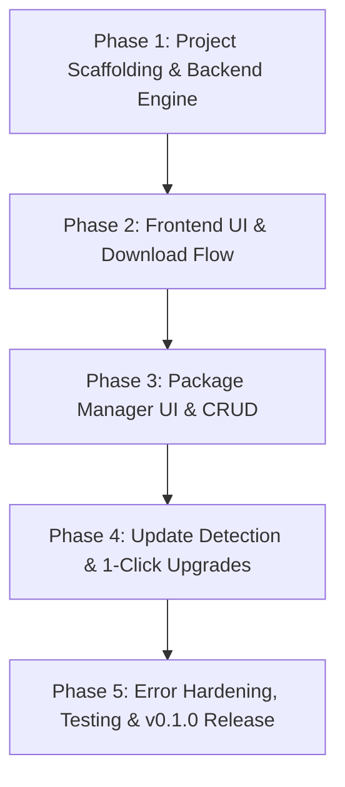

# Development Plan & Actionable Task Breakdown

**Project:** GitHub Release Downloader & Package Manager (Decky Plugin)  
**SemVer Strategy:** `0.1.0-alpha` ➔ `0.1.0-beta` ➔ `0.1.0` (MVP Release) ➔ `0.2.0` (Enhancements) ➔ `1.0.0` (Stable Production)

---

## 1. Semantic Versioning Roadmap

- **`v0.1.0-alpha.1`**: Core Python backend engine (GitHub API parsing, chunked async streaming download, archive extraction, permissions setup, JSON database CRUD).
- **`v0.1.0-alpha.2`**: Frontend UI scaffolding (Tabbed layout, repository input, version selector dropdowns, asset list, download progress bars).
- **`v0.1.0-beta.1`**: Installed packages management UI (List installed packages, calculate directory sizes, uninstall workflow).
- **`v0.1.0-beta.2`**: Update detection and 1-click in-place upgrades.
- **`v0.1.0` (MVP)**: Full end-to-end testing, error handling (rate limit 403s, network drops, sleep/wake resilience), documentation, and Decky store readiness.
- **`v0.2.0`**: Optional Steam shortcut injection (`shortcuts.vdf` non-Steam game creation) and custom download directory selector.
- **`v1.0.0`**: Production-stable release with community feedback incorporated.

---

## 2. Phased Breakdown & Actionable Tasks

---

### Phase 1: Project Scaffolding & Backend Engine (`v0.1.0-alpha.1`)

Goal: Establish repo structure from Decky template, create the Python backend modules for GitHub API communication, file streaming, archive decompression, and local JSON metadata storage.

- [ ] **Task 1.1: Initialize Decky Plugin Scaffolding**
  - Clone/copy base setup from `decky-plugin-template`.
  - Configure `plugin.json` (name, author, flags: `_root`, `debug`, api_version: 1).
  - Configure `package.json`, `pnpm-lock.yaml`, `tsconfig.json`, and `rollup.config.js`.
  - Verify initial build with `pnpm run build`.

- [ ] **Task 1.2: Implement GitHub API Client (`backend/github_api.py`)**
  - Implement async method `fetch_releases(repo: str, token: str = None)` using `aiohttp` or `urllib`.
  - Parse release tags, publish date, pre-release status, and attached assets list.
  - Implement GitHub rate-limit error detection (`403 Forbidden` / `x-ratelimit-remaining`).

- [ ] **Task 1.3: Implement Download & Extraction Service (`backend/downloader.py`)**
  - Implement async chunked download streaming to `/tmp/` with real-time byte counters and speed calculation.
  - Implement event emitter `emit("download_progress", { repo, percent, speed, downloaded, total })`.
  - Implement extraction handlers for `.tar.gz`, `.zip`, `.tar.xz`, and raw `.AppImage` binaries.
  - Apply `chmod +x` (`0o755`) to binaries, shell scripts, and AppImages.
  - Ensure path sanitization to prevent Zip Slip vulnerabilities.

- [ ] **Task 1.4: Implement Installed Packages Registry (`backend/package_db.py`)**
  - Create JSON storage manager for `decky.DECKY_SETTINGS_DIR/packages.json`.
  - Implement CRUD functions: `add_package()`, `get_packages()`, `update_package_version()`, `delete_package()`.
  - Implement disk usage calculation (`shutil.disk_usage` / recursive folder size).

---

### Phase 2: Frontend UI & Download Flow (`v0.1.0-alpha.2`)

Goal: Build the React Quick Access Menu interface for searching repos, viewing release versions, selecting assets, and tracking live downloads.

- [ ] **Task 2.1: Implement Tabbed Navigation & State Management**
  - Implement tab switcher in `src/index.tsx`: `[📦 Installed Packages]` and `[📥 Download New]`.
  - Create React state hooks for active repo, available releases, selected version, and download status.

- [ ] **Task 2.2: Build Repository Input & Release Browser**
  - Create text input component for `<owner>/<repo>`.
  - Add quick-select dropdown for popular/saved repos.
  - Render Version Dropdown with badges (`Latest`, `Pre-release`).
  - Render expandable Release Notes / Changelog preview.

- [ ] **Task 2.3: Build Asset Selection & Smart Platform Filter**
  - Filter and tag assets with a `[Recommended]` badge for Linux-compatible files (`.tar.gz`, `.zip`, `.AppImage`, `x86_64`).
  - Add download trigger button invoking backend `callable("start_download", ...)`.

- [ ] **Task 2.4: Integrate Live Download Progress & Notifications**
  - Hook `addEventListener("download_progress")` to update a visual `<ProgressBar>` in the QAM.
  - Display current speed (e.g. `12.4 MB/s`) and percentage.
  - Trigger `decky.toaster` notifications on download start, completion, or error.

---

### Phase 3: Package Manager UI & Lifecycle (`v0.1.0-beta.1`)

Goal: Provide full management over installed packages in the QAM (inspection, uninstall, version rollbacks).

- [ ] **Task 3.1: Build Installed Packages View**
  - Query backend `callable("get_installed_packages")` on tab mount.
  - Render accordion or card list displaying: package name, repo link, installed version, install date, and folder size.

- [ ] **Task 3.2: Implement Package Deletion / Uninstall Flow**
  - Add `[🗑 Uninstall]` button with confirmation prompt modal.
  - Call backend `callable("uninstall_package", package_id)` to delete directory from `~/Applications/` and remove from `packages.json`.

- [ ] **Task 3.3: Implement Version Reinstall / Rollback Flow**
  - Add `[Change Version]` button that opens the version selection modal for that repository and triggers a clean re-download.

---

### Phase 4: Update Detection & 1-Click Upgrades (`v0.1.0-beta.2`)

Goal: Enable automatic update checks against GitHub and smooth 1-click upgrades.

- [ ] **Task 4.1: Implement Version Comparison Engine (`backend/updater.py`)**
  - Implement backend `callable("check_all_updates")` to batch query `/releases/latest` for all installed packages.
  - Parse semver tags (strip `v` prefix, compare versions).
  - Update `hasUpdate: true` flag in `packages.json`.

- [ ] **Task 4.2: Build Update UI Indicators**
  - Display `[UPDATE AVAILABLE: vX.Y.Z]` badge next to outdated packages in the "Installed" tab.
  - Add `[🔄 Check for Updates]` button in the tab header.

- [ ] **Task 4.3: Implement 1-Click Upgrade Workflow**
  - Add `[⬆ Update to vX.Y.Z]` action button.
  - Automatically match the appropriate asset name based on the previous install.
  - Perform safe in-place replacement and update `packages.json`.
  - Send success toast upon completion.

---

### Phase 5: Error Hardening, QA & v0.1.0 Release

Goal: Verify edge cases on SteamOS Gaming Mode, optimize resource footprint, and tag `v0.1.0`.

- [ ] **Task 5.1: Rate-Limit & Network Resilience**
  - Add Settings modal to enter GitHub Personal Access Token.
  - Handle rate-limit errors gracefully with informative UI alerts and PAT input prompt.
  - Handle network drops and deck sleep/suspend without hanging backend threads.

- [ ] **Task 5.2: Path & Security Auditing**
  - Verify default path `~/Applications/` exists or is created automatically.
  - Verify archive extractor prevents Zip Slip directory traversal.
  - Ensure background CPU/RAM footprint remains negligible during gameplay.

- [ ] **Task 5.3: Documentation & Release Packaging**
  - Finalize `README.md` with installation instructions and screenshots.
  - Create GitHub Actions workflow for building plugin release zip (`.zip` containing `dist/` and `main.py`).
  - Tag `v0.1.0`.
