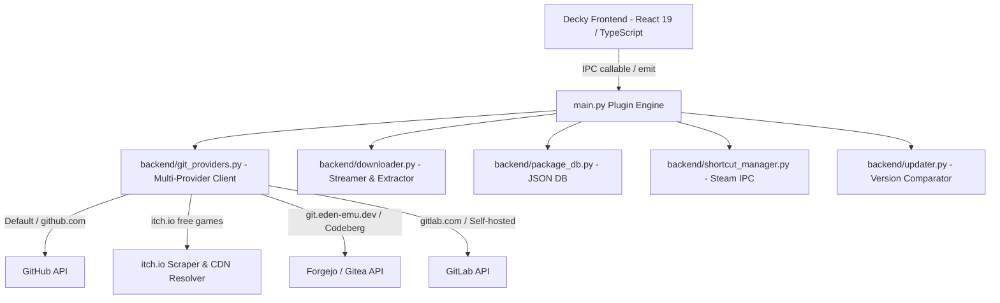

# Development Plan & Architecture Roadmap

**Project:** ReleaseDeck — Universal Git Release Downloader & Package Manager (Decky Plugin)  
**SemVer Strategy:** `0.1.0` (GitHub MVP) ➔ `0.1.1` (Steam Shortcuts & Polishing) ➔ `0.2.0` (Multi-Provider Git Forges) ➔ `1.0.0` (Stable)

---

## 1. Architecture Overview & Modules



### Module Responsibilities

1. **`backend/git_providers.py`**:
   - `parse_repo_spec(input)`: Parses GitHub shorthand, itch.io URLs/prefixes, custom domain URLs, and prefixes.
   - `GitHubProvider`: Interacts with `api.github.com` and GitHub Enterprise.
   - `ItchProvider`: Scrapes itch.io game pages and resolves signed Cloudflare R2 / S3 CDN download links dynamically via `POST /file/<upload_id>`.
   - `GiteaForgejoProvider`: Interacts with Forgejo/Gitea instances (`/api/v1/repos/...`).
   - `GitLabProvider`: Interacts with GitLab instances (`/api/v4/projects/...`).
   - `UnifiedGitClient`: Unified client with auto-probing, schema normalization, and dynamic signed URL resolution.
2. **`backend/downloader.py`**:
   - Chunked HTTP streaming with speed metrics and cancellation.
   - Recursive archive extraction (`.tar.gz`, `.zip`, `.tar.xz`, `.AppImage`).
   - Executable permission scanning (`chmod +x`).
   - Zip Slip directory traversal protection.
3. **`backend/package_db.py`**:
   - JSON persistence for packages and settings.
   - Folder size calculations.
4. **`backend/shortcut_manager.py`**:
   - Steam Non-Steam Game shortcut integration.
5. **`backend/updater.py`**:
   - SemVer and release tag comparison with asset matching.

---

## 2. Completed Milestones

- [x] **v0.1.0 — Initial MVP**
  - Core async downloader and extraction engine.
  - GitHub release discovery and changelog rendering.
  - Package database and installation tracking.
- [x] **v0.1.1 — Gamepad UX & Steam Integration**
  - Seamless 3-step navigation (`repos` ➔ `versions` ➔ `packages`).
  - Automatic Non-Steam Game shortcut registration via `steamos-add-to-steam`.
  - Executable discovery and selector.
  - In-place updates and safe deletion safeguards.
- [x] **v0.2.0 — Multi-Provider Git Forge Support**
  - GitHub as zero-friction default.
  - Support for custom-domain Git forges (Forgejo, Gitea, Codeberg, GitLab).
  - Provider badging and host labeling in QAM.
  - Upstream update checking across heterogeneous Git hosts.
- [x] **v0.3.0 — itch.io Free Games Support**
  - Native itch.io URL parsing (`https://<creator>.itch.io/<game>`, `itch:<creator>/<game>`).
  - Direct metadata scraping (titles, version tags, release notes, file uploads).
  - Dynamic temporary signed CDN URL negotiation at download time (`POST /file/<upload_id>`).
  - Branded itch.io icons (`SiItchdotio`) and platform recommendation sorting.

---

## 3. Testing & Verification Protocols

```bash
# 1. Run all Python unit tests
python3 -m unittest discover -s tests -v

# 2. Run end-to-end simulation harness
python3 tests/e2e_harness.py

# 3. TypeScript check & Rollup frontend build
npm run type-check
npm run build

# 4. Deploy to physical Steam Deck over Wi-Fi
bash scripts/deploy.sh -i <STEAM_DECK_IP>
```
